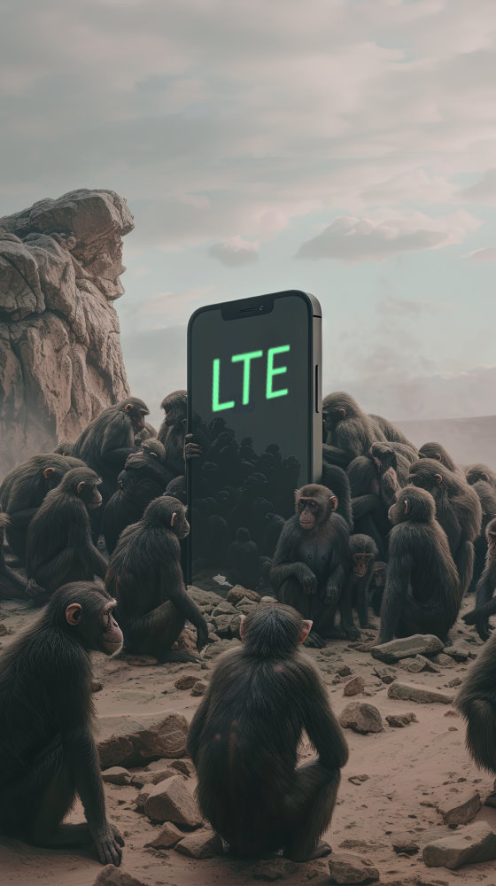

# SILENCE

### Signals Intelligence Wireless Network Security
### Brad Williams · Chris Limson
GMU CYSE 640 Wireless Network Security  
Fall 2024 · Moinul Hossain, PhD  



The goal of collecting data from devices that employ Long-Term Evolution (LTE) presents challenges with the protection of confidentiality and authentication of integrity

When authorities do it, it's called SIGINT. When hackers do it, it's called eavesdropping.
For the sake of avoiding confusion about which perspective we mean, let's simply adhere to the convention that the attacker collects the wireless signals while the defender protects them

Initial attack demonstrated by how basic MATLAB model receives LTE. Uses LTE Toolbox end-to-end link-level simulation

Defender's counter-attack might be to obfuscate the validity of the channel, by generating multiple honeypots

Counter-counter-attack would then be to simulate radio fingerprinting of primary device, versus burner phones, to select authenticated. RF impairments with Communications Toolbox, Simulink

## Resources

For download or online with GMU's Campus-Wide License, MATLAB and Simulink https://matlab.mathworks.com  
Download details:  
matlab_R2024b_Windows.exe (220 MB; SHA256: 2a32ddff3186306f5ed6c1b2dc996ee0978b5990f623f6511a651728e3c269f3)

GNU Radio https://www.gnuradio.org  
On Ubuntu 24.04  
```
sudo apt install gnuradio

gnuradio-companion
```

## Reference
Step-by-step instructions [https://chrimson.github.io/SILENCE](https://chrimson.github.io/SILENCE)  
[https://ieeexplore.ieee.org/document/7454387](https://ieeexplore.ieee.org/document/7454387)

## Documentation
(placeholders for now)  
[CYSE640_BradChris_ProjectProposalPresentation.pdf](docs/CYSE640_BradChris_ProjectProposalPresentation.pdf)  
[CYSE640_BradChris_ProjectProposalReport.pdf](docs/CYSE640_BradChris_ProjectProposalReport.pdf)  
[CYSE640_BradChris_ProjectFinalPresentation.pdf](docs/CYSE640_BradChris_ProjectFinalPresentation.pdf)  
[CYSE640_BradChris_ProjectFinalReport.pdf](docs/CYSE640_BradChris_ProjectFinalReport.pdf)  


## Notes

https://en.wikipedia.org/wiki/Radio_fingerprinting  
HW challenge, no simulator, no research, etc.  
20-30 research papers  
Malicious access point detection of secure facility  
Man-in-the-middle attacking radio signatures  

~~We will describe the basics of what SIGINT is and how Wireless Network Security applies to it, general methodologies, logistics and systems that are fundamental~~

~~And then areas that are potentially open for innovation, development and investigation. How signal analysis can still be written for MATLAB to include environmental or experimental simulations~~

~~Hardware on an assigned plane (consisting of special things like the ugly AWACS) picks up RF signals of a questionable nation state~~

~~Raw signal waveforms are recorded and sent via securely encrypted channel to ground base station, then maybe again to where more powerful servers can organize collected data, crunch numbers~~

~~Signal analysis tools like MATLAB, Simulink and GNU Radio identifies which ones are valid, what can be cleaned up or extracted from noise, based on properties, patterns or behaviors~~

~~When does decryption occur? Are these necessarily always network data, or might it be analog/voice~~

~~Info source -> encrypt -> encode -> modulation -> air -> antenna -> radio frequency receiver -> tune to the freq of interest -> digitize (convert analog signal from the air into samples)~~

~~Digitized samples can be processed in the same place as the receiver, or they can be forwarded to a data center for processing. Also known as the forwarding channel~~

~~Demodulation -> decode -> decrypt -> info~~

~~At the info source, voice is "digitized", "compressed (voice coding)" After this it follows the same "encrypt -> encode -> modulation"~~

## License
[MIT](LICENSE)
